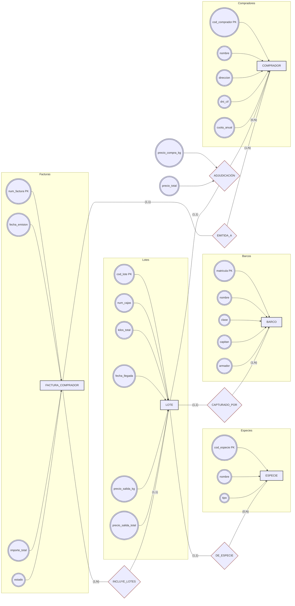

```mermaid
flowchart LR   

  classDef entidad stroke:#333,stroke-width:2px;
  classDef relacion stroke:#a66,stroke-width:2px;

  classDef entidad stroke:#333,stroke-width:2px;
  classDef relacion stroke:#a66,stroke-width:2px;
  classDef atributo stroke:#446,stroke-width:1.5px;

  %% Entidades
  Lote[LOTE]:::entidad
  Especie[ESPECIE]:::entidad
  Barco[BARCO]:::entidad
  Comprador[COMPRADOR]:::entidad
  FacturaC[FACTURA_COMPRADOR]:::entidad

  %% Relaciones
  DeEspecie{DE_ESPECIE}:::relacion
  CapturadoPor{CAPTURADO_POR}:::relacion
  Adjudicacion{ADJUDICACIÓN}:::relacion
  EmiteC{EMITIDA_A}:::relacion
  IncluyeLC{INCLUYE_LOTES}:::relacion

  %% Atributos LOTE
  subgraph Lotes
  cod_lote(((cod_lote PK))):::atributo --> Lote
  num_cajas(((num_cajas))):::atributo --> Lote
  kilos_total(((kilos_total))):::atributo --> Lote
  fecha_llegada(((fecha_llegada))):::atributo --> Lote
  precio_salida_kg(((precio_salida_kg))):::atributo --> Lote
  precio_salida_total(((precio_salida_total))):::atributo --> Lote
  end

  %% Atributos ESPECIE
  subgraph Especies
  cod_especie(((cod_especie PK))):::atributo --> Especie
  nombre_especie(((nombre))):::atributo --> Especie
  tipo_especie(((tipo))):::atributo --> Especie
  end

  %% Atributos BARCO
  subgraph Barcos
  matricula(((matricula PK))):::atributo --> Barco
  nombre_barco(((nombre))):::atributo --> Barco
  clase_barco(((clase))):::atributo --> Barco
  capitan(((capitan))):::atributo --> Barco
  armador(((armador))):::atributo --> Barco
  end

  %% Atributos COMPRADOR
  subgraph Compradores
  cod_comprador(((cod_comprador PK))):::atributo --> Comprador
  nombre_compr(((nombre))):::atributo --> Comprador
  direccion_compr(((direccion))):::atributo --> Comprador
  dni_cif(((dni_cif))):::atributo --> Comprador
  cuota_anual(((cuota_anual))):::atributo --> Comprador
  end

  %% Atributos FACTURA_COMPRADOR
  subgraph Facturas
  num_fact_c(((num_factura PK))):::atributo --> FacturaC
  fecha_emision_c(((fecha_emision))):::atributo --> FacturaC
  importe_total_c(((importe_total))):::atributo --> FacturaC
  estado_c(((estado))):::atributo --> FacturaC
  end

  %% Atributos de la RELACIÓN ADJUDICACIÓN
  precio_compra_kg(((precio_compra_kg))):::atributo --> Adjudicacion
  precio_total(((precio_total))):::atributo --> Adjudicacion

  %% Conexiones y cardinalidades
  Lote ---|"(1,1)"| DeEspecie
  DeEspecie ---|"(0,N)"| Especie

  Lote ---|"(1,1)"| CapturadoPor
  CapturadoPor ---|"(1,N)"| Barco

  Lote ---|"(1,1)"| Adjudicacion
  Adjudicacion ---|"(0,N)"| Comprador

  FacturaC ---|"(1,1)"| EmiteC
  EmiteC ---|"(1,N)"| Comprador

  FacturaC ---|"(1,N)"| IncluyeLC
  IncluyeLC ---|"(1,1)"| Lote

```
