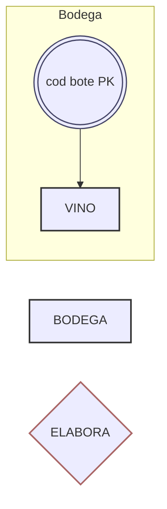

```mermaid
flowchart LR   

  classDef entidad stroke:#333,stroke-width:2px;
  classDef relacion stroke:#a66,stroke-width:2px;
  classDef atributo stroke:#446,stroke-width:1.5px;

  %% Entidades
  Bodegas[BODEGA]:::entidad
  Vino[VINO]:::entidad

  %% Relaciones
  Elabora{ELABORA}:::relacion

  %% Atributos BODEGA
  subgraph Bodega
  code_Bodega(((cod bote PK))):::atributo --> Vino
  end

```
