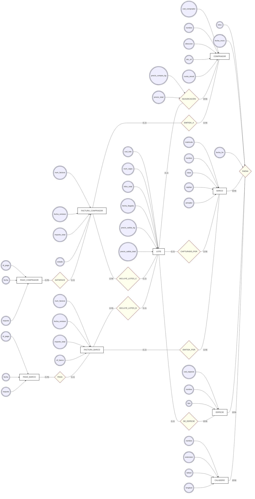

```mermaid
flowchart LR
  classDef entidad fill:#fff,stroke:#333,stroke-width:2px;
  classDef relacion fill:#ffe,stroke:#a66,stroke-width:2px;
  classDef atributo fill:#eef,stroke:#446,stroke-width:1.5px;

  %% ENTIDADES
  Lote[LOTE]:::entidad
  Especie[ESPECIE]:::entidad
  Barco[BARCO]:::entidad
  Comprador[COMPRADOR]:::entidad
  Caladero[CALADERO]:::entidad
  FacturaC[FACTURA_COMPRADOR]:::entidad
  FacturaB[FACTURA_BARCO]:::entidad
  PagoC[PAGO_COMPRADOR]:::entidad
  PagoB[PAGO_BARCO]:::entidad

  %% ATRIBUTOS (círculos)
  cod_lote(((cod_lote))):::atributo --> Lote
  num_cajas(((num_cajas))):::atributo --> Lote
  kilos_total(((kilos_total))):::atributo --> Lote
  fecha_llegada(((fecha_llegada))):::atributo --> Lote
  precio_salida_kg(((precio_salida_kg))):::atributo --> Lote
  precio_salida_total(((precio_salida_total))):::atributo --> Lote

  cod_especie(((cod_especie))):::atributo --> Especie
  nombre_especie(((nombre))):::atributo --> Especie
  tipo_especie(((tipo))):::atributo --> Especie

  matricula(((matricula))):::atributo --> Barco
  nombre_barco(((nombre))):::atributo --> Barco
  clase_barco(((clase))):::atributo --> Barco
  capitan(((capitan))):::atributo --> Barco
  armador(((armador))):::atributo --> Barco

  cod_compr(((cod_comprador))):::atributo --> Comprador
  nombre_compr(((nombre))):::atributo --> Comprador
  direccion_compr(((direccion))):::atributo --> Comprador
  dni_cif(((dni_cif))):::atributo --> Comprador
  cuota_anual(((cuota_anual))):::atributo --> Comprador

  nombre_cal(((nombre))):::atributo --> Caladero
  extension(((extension))):::atributo --> Caladero
  latitud(((latitud))):::atributo --> Caladero
  longitud(((longitud))):::atributo --> Caladero

  num_fact_c(((num_factura))):::atributo --> FacturaC
  fecha_em_c(((fecha_emision))):::atributo --> FacturaC
  importe_tot_c(((importe_total))):::atributo --> FacturaC
  estado_c(((estado))):::atributo --> FacturaC

  num_fact_b(((num_factura))):::atributo --> FacturaB
  fecha_em_b(((fecha_emision))):::atributo --> FacturaB
  importe_tot_b(((importe_total))):::atributo --> FacturaB
  cif_barco(((cif_barco))):::atributo --> FacturaB

  id_pago_c(((id_pago))):::atributo --> PagoC
  fecha_pc(((fecha))):::atributo --> PagoC
  importe_pc(((importe))):::atributo --> PagoC

  id_pago_b(((id_pago))):::atributo --> PagoB
  fecha_pb(((fecha))):::atributo --> PagoB
  importe_pb(((importe))):::atributo --> PagoB

  %% RELACIONES (rombos)
  DeEspecie{DE_ESPECIE}:::relacion
  CapturadoPor{CAPTURADO_POR}:::relacion
  Adjudicacion{ADJUDICACIÓN}:::relacion
  EmiteC{EMITIDA_A}:::relacion
  IncluyeLC{INCLUYE_LOTES_C}:::relacion
  EmiteB{EMITIDA_POR}:::relacion
  IncluyeLB{INCLUYE_LOTES_B}:::relacion
  Satisface{SATISFACE}:::relacion
  Paga{PAGA}:::relacion
  Faena{FAENA}:::relacion

  %% Atributos de relaciones
  precio_compra_kg(((precio_compra_kg))):::atributo --> Adjudicacion
  precio_total(((precio_total))):::atributo --> Adjudicacion

  kilos_f(((kilos))):::atributo --> Faena
  f_ini(((fecha_inicio))):::atributo --> Faena
  f_fin(((fecha_fin))):::atributo --> Faena

  %% ENLACES Y CARDINALIDADES (mín, máx)
  Lote ---|"(1,1)"| DeEspecie
  DeEspecie ---|"(0,N)"| Especie

  Lote ---|"(1,1)"| CapturadoPor
  CapturadoPor ---|"(1,N)"| Barco

  Lote ---|"(1,1)"| Adjudicacion
  Adjudicacion ---|"(0,N)"| Comprador

  FacturaC ---|"(1,1)"| EmiteC
  EmiteC ---|"(1,N)"| Comprador

  FacturaC ---|"(1,N)"| IncluyeLC
  IncluyeLC ---|"(1,1)"| Lote

  PagoC ---|"(1,N)"| Satisface
  Satisface ---|"(1,1)"| FacturaC

  FacturaB ---|"(1,1)"| EmiteB
  EmiteB ---|"(1,N)"| Barco

  FacturaB ---|"(1,N)"| IncluyeLB
  IncluyeLB ---|"(1,1)"| Lote

  PagoB ---|"(1,N)"| Paga
  Paga ---|"(1,1)"| FacturaB

  Barco ---|"(0,N)"| Faena
  Especie ---|"(0,N)"| Faena
  Caladero ---|"(0,N)"| Faena

```
