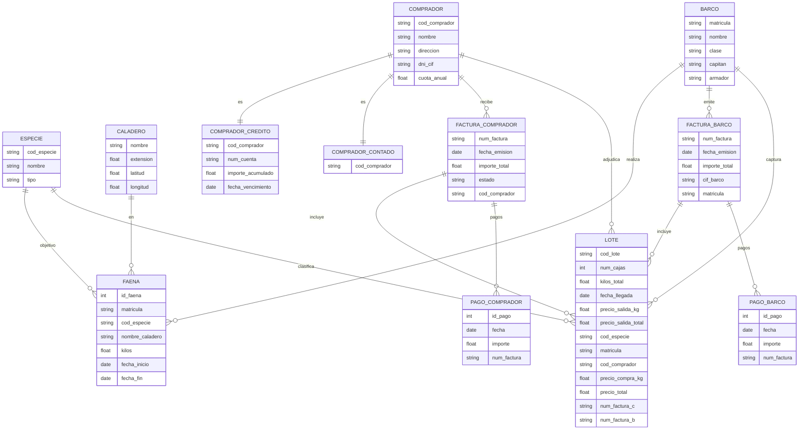

```mermaid
erDiagram

    ESPECIE {
        string cod_especie
        string nombre
        string tipo
    }

    BARCO {
        string matricula
        string nombre
        string clase
        string capitan
        string armador
    }

    CALADERO {
        string nombre
        float  extension
        float  latitud
        float  longitud
    }

    COMPRADOR {
        string cod_comprador
        string nombre
        string direccion
        string dni_cif
        float  cuota_anual
    }

    COMPRADOR_CONTADO {
        string cod_comprador
    }

    COMPRADOR_CREDITO {
        string cod_comprador
        string num_cuenta
        float  importe_acumulado
        date   fecha_vencimiento
    }

    FACTURA_COMPRADOR {
        string num_factura
        date   fecha_emision
        float  importe_total
        string estado
        string cod_comprador
    }

    PAGO_COMPRADOR {
        int    id_pago
        date   fecha
        float  importe
        string num_factura
    }

    FACTURA_BARCO {
        string num_factura
        date   fecha_emision
        float  importe_total
        string cif_barco
        string matricula
    }

    PAGO_BARCO {
        int    id_pago
        date   fecha
        float  importe
        string num_factura
    }

    LOTE {
        string cod_lote
        int    num_cajas
        float  kilos_total
        date   fecha_llegada
        float  precio_salida_kg
        float  precio_salida_total

        string cod_especie
        string matricula

        string cod_comprador
        float  precio_compra_kg
        float  precio_total

        string num_factura_c
        string num_factura_b
    }

    FAENA {
        int    id_faena
        string matricula
        string cod_especie
        string nombre_caladero
        float  kilos
        date   fecha_inicio
        date   fecha_fin
    }

    %% Relaciones (crow's foot):
    ESPECIE         ||--o{ LOTE : clasifica
    BARCO           ||--o{ LOTE : captura
    COMPRADOR       ||--o{ LOTE : adjudica

    COMPRADOR       ||--o{ FACTURA_COMPRADOR : recibe
    FACTURA_COMPRADOR ||--o{ PAGO_COMPRADOR  : pagos
    FACTURA_COMPRADOR ||--o{ LOTE            : incluye

    BARCO           ||--o{ FACTURA_BARCO : emite
    FACTURA_BARCO   ||--o{ PAGO_BARCO    : pagos
    FACTURA_BARCO   ||--o{ LOTE          : incluye

    COMPRADOR ||--|| COMPRADOR_CONTADO : es
    COMPRADOR ||--|| COMPRADOR_CREDITO : es

    BARCO    ||--o{ FAENA : realiza
    ESPECIE  ||--o{ FAENA : objetivo
    CALADERO ||--o{ FAENA : en

```
