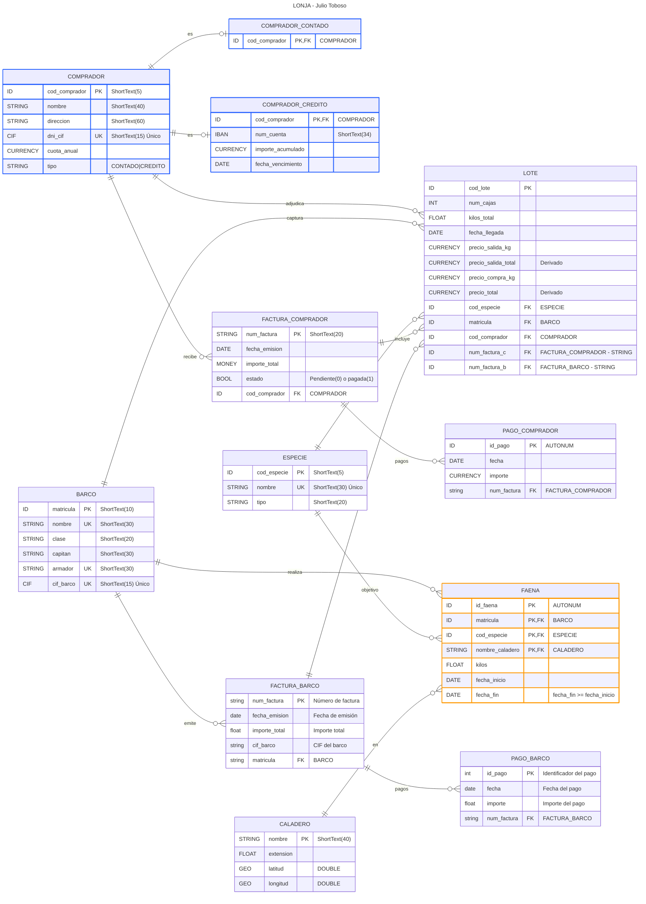

# Práctica 1 
## Modelos Conceptual y Relacional
## $\text{Julio Toboso}$
### 1. Objetivos.
- **Access** 2016/2019/2021/2024. 
  - Modelización ERE y su correspondiente Relacional,
  - Creación de tablas con sus campos así como la definición de los dominios de los campos y establecimiento de las relaciones.
### 2. Enunciado de la práctica.
La lonja de pescado de Santa Pola desea agilizar la gestión de su negocio a tal efecto, nos solicita proveerlos de una solución de bases de datos. Cada día, los barcos llevan la pesca a la lonja, siendo que allí, se subasta la captura. Normalmente los compradores son pescaderías de la zona. Tras múltiples entrevistas con los usuarios y labores de análisis previo, hemos obtenido las siguientes especificaciones iniciales:
- [x] A la llegada de la captura del día, esta se distribuye en lotes, momento en el que se les asigna un código único.
  - [ ] Tras este trabajo inicial los lotes se subastan.
  - [x] Cada lote consta de un número de cajas
  - [x] de una determinada especie (por ejemplo, pescadilla, boquerones, cangrejos, etc.)
  - [x] así como el número de kilos total
  - [x] y la fecha de llegada.
      
  - [x] Además, es necesario conocer el precio por kilo de salida
  - [x] y el precio total de salida del lote.
         
- [x]  De cada especie guardaremos cierto código no repetible,
- [x]  un nombre
- [ ]  y un tipo (por ejemplo, moluscos, pescado blanco, etc.).

    
- [x]  Se almacenará también información sobre los barcos que entregan la pesca en la lonja para saber  **qué barco capturó cada lote**,

- [x]  De dichos barcos guardaremos su matrícula,
- [x]  nombre,
- [x]  clase,
- [x]  nombre del capitán
- [x]  y así como del armador.
    
- [ ]  Resulta que los barcos pueden capturar las especies que componen los lotes
- [ ]  y faenar en diferentes caladeros.
    
- [ ]  De dichos caladeros nos interesa conocer el nombre (único),
- [ ]  su extensión
- [ ]  y ubicación (definida mediante las coordenadas GPS
    - [ ]  latitud y
    - [ ]  longitud).
        
- [ ]  En la lonja es imperativo saber
    - [ ]  qué barcos
    - [ ]  y en qué caladeros
    - [ ]  se han capturado las especies
    - [ ]  (los kilos de cada especie
    - [ ]  y periodo de tiempo de faena representado por
        - [ ]  una fecha de inicio
        - [ ]  y otra de fin).
        - [ ]  
- [ ]  Una vez empezada la subasta, los distintos compradores pujan por los lotes en los que están interesados. A los compradores se les asigna un código (no repetible), su nombre,
dirección, DNI o CIF, así como la cuota anual que deben pagar a la lonja en cuestión.

Finalmente, cada lote será adquirido por el comprador que realice la mejor puja. De
estas adquisiciones se guarda el precio de compra por kilo y el precio total de
adjudicación del lote.
• Es crucial la información de los pagos que realiza la lonja a los barcos que entregan la
pesca diaria y de los pagos que efectúan los compradores por la adquisición de los lotes.
Respecto a los compradores, existen compradores que tienen crédito, realizando los
pagos al final de cada mes; de estos compradores se guarda un número de cuenta
bancaria, el último importe acumulado hasta el momento y la fecha de vencimiento del
pago (sólo nos interesa la mensualidad en curso). Por otro lado, existen los compradores
que realizan los pagos al contado sobre los que no se necesita guardar información
adicional. Un comprador no puede ser de ambos tipos a la vez.
• La lonja genera una factura que incluye uno o varios lotes que ha adquirido el
comprador. De estas facturas se guarda un número, una fecha de emisión y el importe
total. En dichas facturas consta el comprador (que es quien deberá abonarla) así como
los lotes que incluye. En las facturas emitidas por los barcos, la lonja almacena además
de los datos mencionados de la factura, el CIF del barco y los códigos de lote
facturados. En las facturas emitidas a los compradores sin crédito necesitamos saber el
estado de éstas (pendiente o pagada).

3.1. Modelo ERE.
A partir de la información descrita en al anterior apartado realizar el diseño del esquema
conceptual (ERE) utilizando Microsoft Word o similar para documentarlo. Dicho documento,
además de contar con el grafo ERE ajustado a los elementos impartidos en clase, ha de contar
con un apartado que indique, razonadamente, todos los supuestos semánticos que se han
realizado, y que surgen de la ausencia de información relativa en ellos en el propio enunciado.
En definitiva, se trata de incluir, además de los supuestos semánticos que se consideren
oportunos para justificar todas las decisiones de diseño y la semántica perdida si la hubiese, los
siguientes elementos:
• Entidades.
• Interrelaciones (Relaciones).
• Tipo de Interrelaciones (Tipo de Relación).
• Participación de las entidades en las Interrelaciones.
• Participaciones máximas y mínimas de las entidades en las Interrelaciones.
• Respecto a las relaciones, existe una relación ternaria que el alumno debe identificar.
De igual manera se debe identificar la cardinalidad de cada rama, así como las
participaciones máximas y mínimas.
• Atributos según tipología.
• Generalización – Especialización.
• … en definitiva todos los elementos explicados para los esquemas ERE necesarios para
reflejar el enunciado los más fielmente posible.

3.2. Modelo Relacional.
Basándose en el esquema conceptual (Modelo ERE) desarrollado en el anterior apartado
se deberá crear el Modelo Relacional, el cual reflejará lo más fielmente posible una solución al
problema que se nos plantea. Éste se ha de documentar utilizando la herramienta Microsoft Visio
usando la plantilla para Bases de Datos relacionales con notaciones IDEF1X haciendo constar,
los siguientes elementos:
• Tablas con sus atributos o campos y sus dominios.
• Claves Primarias y Alternativas.
• Claves Ajenas indicando su dependencia.
• Los posibles o no nulos.
• Valores por defecto.
• Cardinalidades.
• Acción para la preservación de la Integridad Referencial.
•
… en definitiva, todos los elementos explicados para los esquemas relacionales que sean
necesarios para plasmar el enunciado.
Solo se podrán usar los siguientes tipos de datos: VARCHAR, CHAR, NUMBER y
DATE. Recordad que es importante que el tipo de dato, y en general el dominio de cada atributo,
esté desarrollado conforme al concepto que representa.
La forma de transformar una relación ternaria del tipo Muchos, Muchos, Muchos
(N:N:N) es, una vez creadas las tablas correspondientes a las entidades partícipes, crear una
nueva tabla que representará dicha relación ternaria y que debe incluir como claves foráneas las
claves principales de cada una de las tres entidades partícipes. El conjunto formado por estas
claves foráneas será la clave principal de la nueva tabla. En dicha nueva tabla se debe incluir
también los atributos de la relación siguiendo los mismos criterios que se siguen en los atributos
de una relación binaria de tipo N:N.
3.3. Creación de la base de datos.
En consonancia con lo desarrollado en el anterior apartado, construid el definitivo
esquema de base de datos relacional en Access.
4. Formato y fecha de entrega
Esta práctica se entregará de forma individual. El plazo máximo para la entrega de esta
práctica es el 05/11/2025 a las 23:55 horas a través del portal de entrega de tareas de la asignatura
del acceso identificado de la UMH.
Se entregará un fichero comprimido en formato .zip o .rar cuyo contenido ha de ser:
a) Un documento de Word o pdf con la siguiente información:
1. DNI, Nombre y Apellidos del Alumno.
2. Diseño Conceptual incluyendo los supuestos semánticos y la semántica
perdida.
b) El fichero Microsoft Visio con el diseño del modelo relacional.
c) Las base de datos de Access que se construya a partir del modelo relacional.

# Notas:
- Los tipos ID son aliases para lo que seguramente debería ser un STRING, pero que representa un código único que bien podría ser un INT o POSITIVE.
- GEO es un alias para el tipo que se utilice para coordenadas. 
