#  Práctica 1 — Lonja de Santa Pola  

**Modelo Conceptual (ERE) y Relacional**

## $\text{Julio Toboso}$

# 1. Objetivos.
- **Access** 2016/2019/2021/2024. 
  - Modelización ERE y su correspondiente Relacional,
  - Creación de tablas con sus campos así como la definición de los dominios de los campos y establecimiento de las relaciones.


# 2. Enunciado de la práctica.
La lonja de pescado de Santa Pola desea agilizar la gestión de su negocio a tal efecto, nos solicita proveerlos de una solución de bases de datos. 

Cada día, los barcos llevan la pesca a la lonja, siendo que allí, se subasta la captura. Normalmente los compradores son pescaderías de la zona. Tras múltiples entrevistas con los usuarios y labores de análisis previo, hemos obtenido las siguientes especificaciones iniciales:


# Lotes
La captura del día se distribuye en lotes.
- [x] Lotes
	- [x] Código único
    - [x] Número de cajas
    - [x] Una determinada especie
    - [x] Número de kilos total
    - [x] Fecha de llegada
      
    - [x] Precio por kilo de salida
    - [x] Precio total de salida del lote
    - [x] **Qué barco capturó cada lote**
         

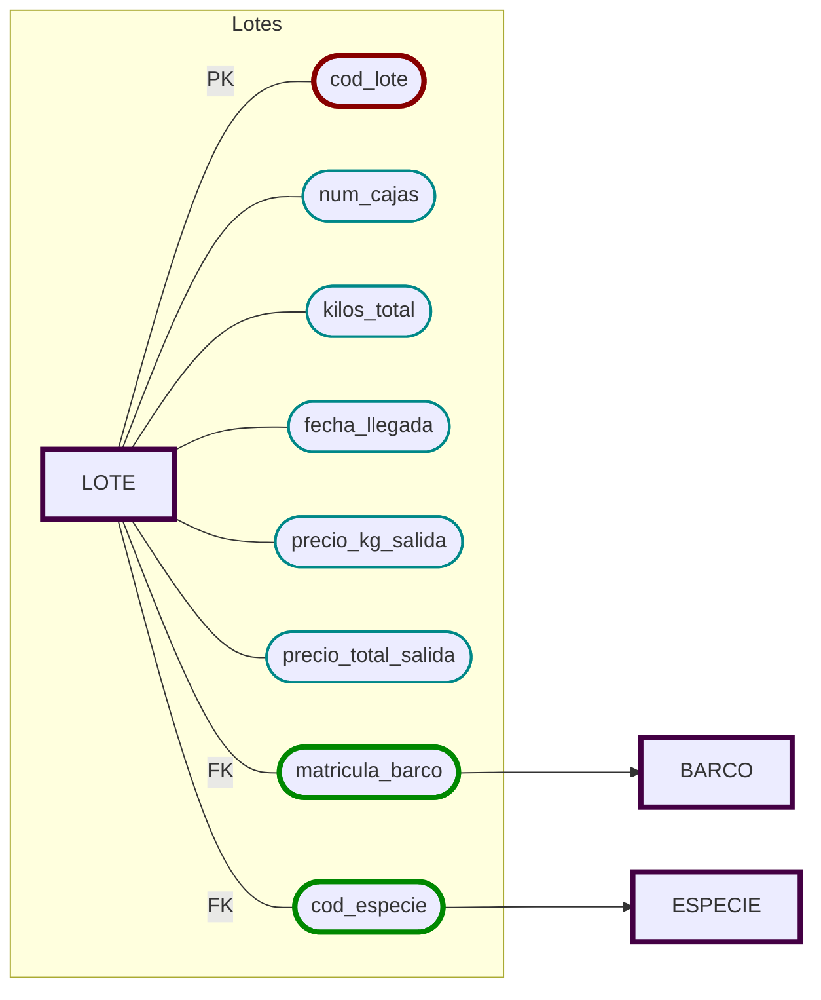
```sql
CREATE TABLE LOTE (
    cod_lote            CHAR(5) PRIMARY KEY,
    num_cajas           NUMBER(6,0),
    kilos_total       	NUMBER(8,2),
    fecha_llegada       DATE,
    precio_kg_salida    NUMBER(8,2),
    precio_total_salida NUMBER(8,2),
    cod_especie         VARCHAR(5) REFERENCES ESPECIE,
    matricula_barco     CHAR(10) REFERENCES BARCO
    );
```


---

# Especies
  - [x]  🔐 Código (no repetible)
  - [x]  Nombre
  - [x]  Tipo (por ejemplo, moluscos, pescado blanco, etc.).
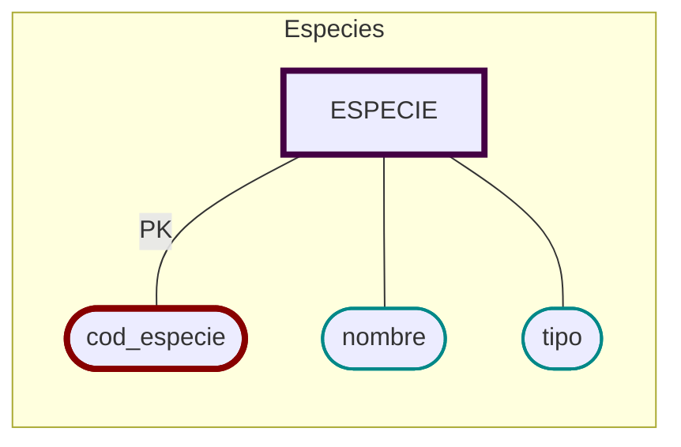
```sql
CREATE TABLE ESPECIE (
    cod_especie   VARCHAR(5) PRIMARY KEY,
    nombre        VARCHAR(30),
    tipo          VARCHAR(20)
    );
```


----

# Barcos
  - [x]  🔐 Matrícula
  - [x]  Nombre
  - [x]  Clase
  - [x]  Nombre del capitán
  - [x]  Nombre del armador
  - [x]  CIF
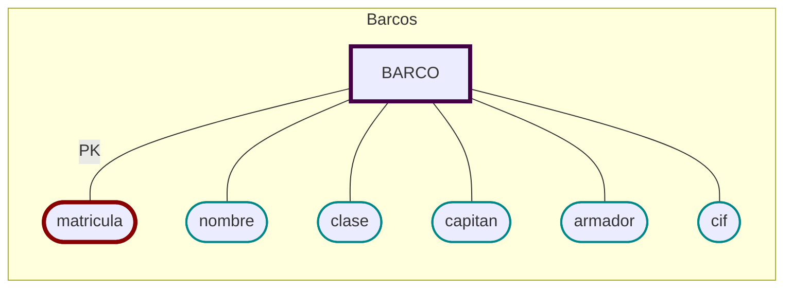

```sql
CREATE TABLE BARCO (
    matricula     CHAR(10) PRIMARY KEY,
    nombre        VARCHAR(30),
    clase         VARCHAR(20),
    capitan       VARCHAR(30),
    armador       VARCHAR(30),
    cif       	  VARCHAR(15) UNIQUE
    );
```
CIF es un formato fijo... en españa. Es razonable pensar que uina lonja puede tener pesqueros faenando de otros países. En el caso de Santa Pola, podrían ser de Marruecos, Italia, Francia, Tunez... Y cualquier embarcación europea tiene permiso de trabajo en el territorio de la UE. 

Por ello, es posible que la lonja pueda necesitar guardar cifs de otros formatos, aunque sea algo extraordinario. Un VARCHAR es mejor opción que CHAR por la presencia de estos casos excepcionales.

Igualmente para los DNI/CIF de los compradores, que probablemente son residentes de Santa Pola. Una población que tiene gran porcentaje de residentes permanentes de origen extranjero.  


---

# Caladeros
  - [x]  🔐 Nombre (único),
  - [x]  Extensión
  - [x]  Ubicación [GPS]
      - [x]  latitud 
      - [x]  longitud.
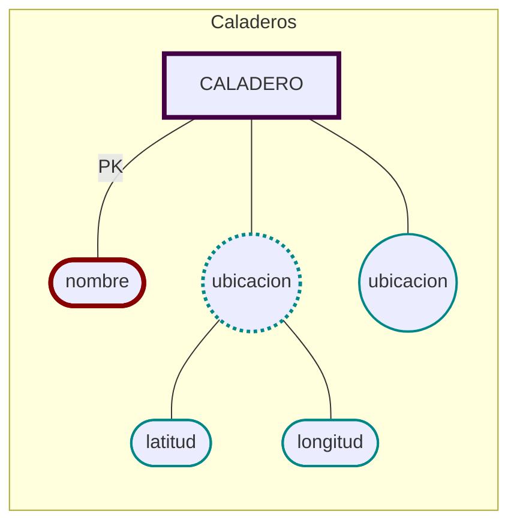
```sql
CREATE TABLE CALADERO (
    nombre        VARCHAR(40) PRIMARY KEY,
    extension     NUMBER(10,2),
    latitud       NUMBER(8,5),
    longitud      NUMBER(8,5)
    );
```


----

# Faenaje
- [x]  Faena
    - [x]  🔏 Un barco (matrícula)
    - [x]  🔏 En un caladero (nombre)
    - [x]  🔏 Una especie (código)
    - [x]  los kilos obtenidos de cada especie
    - [x]  en un intervalo de tiempo
        - [x]  una fecha de inicio
        - [x]  y otra de fin.

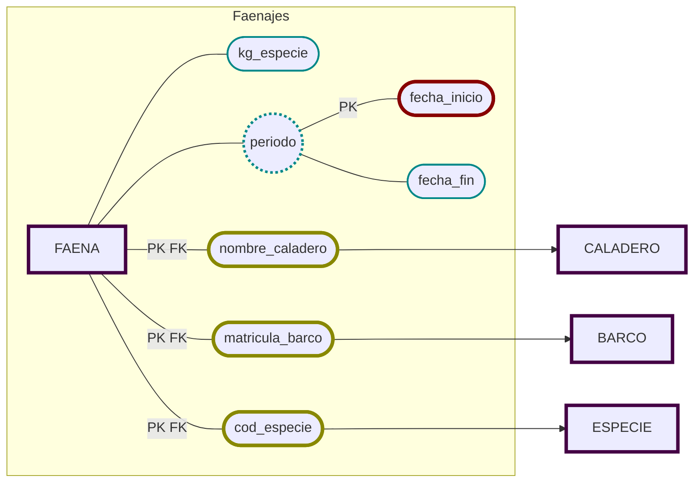
```sql
CREATE TABLE FAENA (
    matricula_barco CHAR(10)   REFERENCES BARCO,
    nombre_caladero VARCHAR(40) REFERENCES CALADERO,
    cod_especie     VARCHAR(5) REFERENCES ESPECIE,
    kg_especie 		NUMBER(8,2),
    fecha_inicio    DATE,
    fecha_fin       DATE,
    PRIMARY KEY (matricula_barco, nombre_caladero, cod_especie, fecha_inicio)
    );
```


# Compradores
- [x]  Compradores.
  - [x]  🔐 Código (no repetible),
  - [x]  Nombre,
  - [x]  Dirección,
  - [x]  DNI o CIF,
  - [x]  Cuota anual que deben pagar a la lonja.


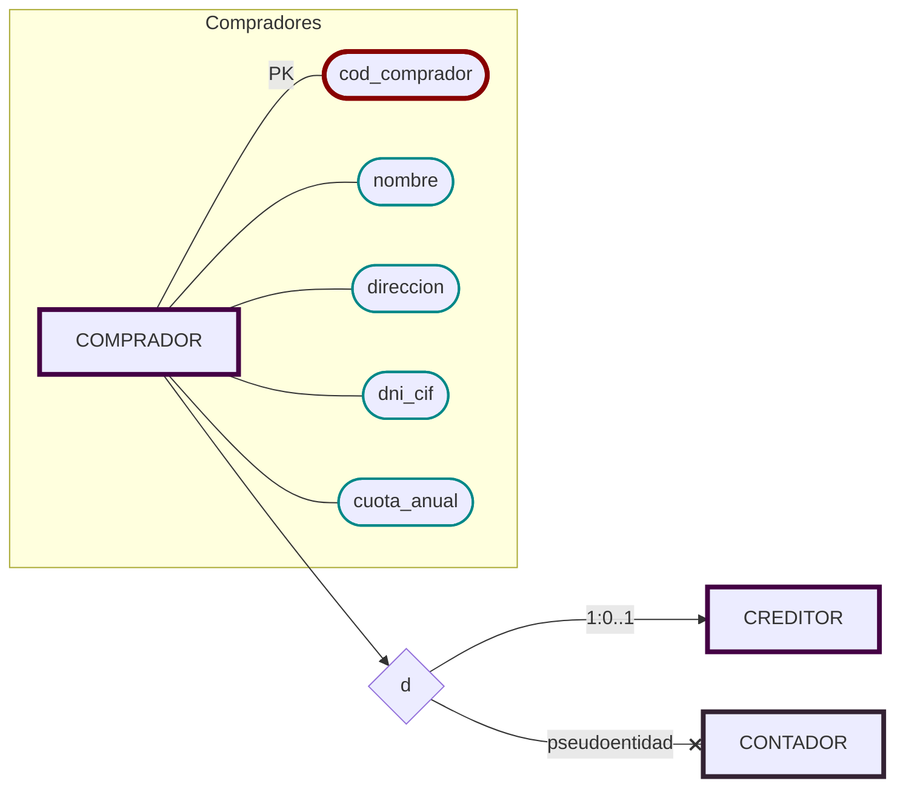


## Compradores: Creditores y Contadores
- [x] Existen compradores que tienen crédito (creditores), realizando los pagos al final de cada mes;
  - [x]  Se guarda un número de cuenta bancaria,
  - [x]  el último importe acumulado hasta el momento
  - [x]  y la fecha de vencimiento del pago.
     
- [x]  Existen los compradores que realizan los pagos al contado (contadores) sobre los que no se necesita guardar información adicional.

- [x]  Un comprador no puede ser de ambos tipos a la vez.

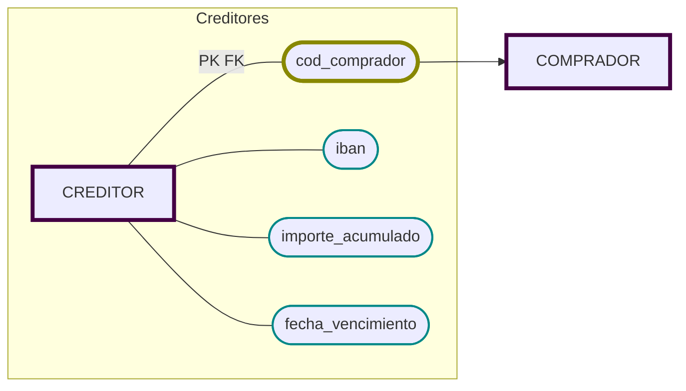
#### 📝 Notas de Diseño:
- Tabla COMPRADOR: todos los compradores, sin distinguir.
- Tabla CREDITOR: solo los compradores que tienen crédito.
  - cod_comprador = PK y FK a COMPRADOR.
  - Si un comprador está en esta tabla ⇒ es de crédito.
  - Si no está ⇒ es de contado.

Implementación de _especialización por predicado_.

Sin tabla para contado. No es necesaria. Ambos grupos son excluyentes. Si está en  _creditor_, no es _contador_.

```sql
CREATE TABLE COMPRADOR (
    cod_comprador CHAR(5) PRIMARY KEY,
    nombre        VARCHAR(40),
    direccion     VARCHAR(60),
    dni_cif       VARCHAR(15) UNIQUE,
    cuota_anual   NUMBER(8,2)
    );

CREATE TABLE CREDITOR (
    cod_comprador     CHAR(5) PRIMARY KEY
                      REFERENCES COMPRADOR,
    iban              CHAR(24),
    importe_acumulado NUMBER(10,2),
    fecha_vencimiento DATE
    );
```

Suponemos que todo comprador que no aparece en CREDITOR opera al contado.
Por tanto: 
- Cada cod_comprador puede aparecer a lo sumo una vez en CREDITOR (PK).
- Si aparece: es crédito.
- No hay forma de que también sea de otro tipo, porque no hay otra subtabla.
- Disjunto garantizado.
- No hay basura ni nulos forzados.
- Contado = los que no están en CREDITOR
  -   Totalidad cubierta, sin necesidad de un atributo tipo

Un IBAN es un "número" de cuenta, pero contiene caracteres no numéricos (ES, FR, US...). Considero mejor guardarla como un CHAR de 24 caracteres. Se requerirá verificación. 


# Adjudicación
Los lotes se subastan. Cada lote será adquirido por el comprador que realice la mejor puja. 

- [x] Adjudicación 
  - [x] Precio de compra por kilo
  - [x] Precio total de adjudicación del lote
  - [x] Cada lote será adquirido por __un__ comprador.
  - [x] Un comprador puede adquirir varios lotes

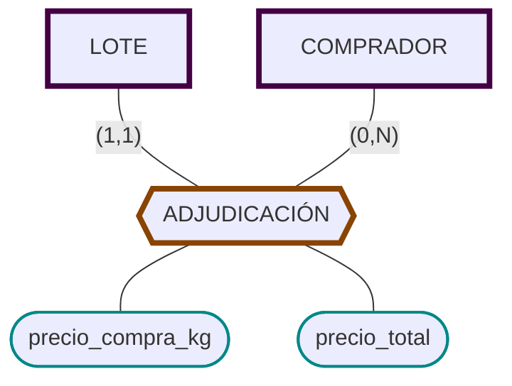
```sql
CREATE TABLE ADJUDICACION (
    cod_lote            CHAR(5) PRIMARY KEY
                        REFERENCES LOTE,
    cod_comprador       CHAR(5) NOT NULL
                        REFERENCES COMPRADOR,
    precio_kg		    NUMBER(8,2),
    precio_total		NUMBER(8,2)
	);

```
`cod_lote` es PK porque cada lote solo puede venderse una vez. Cada Lote tiene una Adjudicación exacta.

`cod_comprador` es NOT NULL porque cada lote debe adjudicarse a alguien. Si no se adjudica, no se añade a la tabla. 


Si se modelara la subasta completa, sería necesario realizar la tabla que sería resultado de esa relación. Dentro de la dinámica de 'minimizar a lo necesario', no creo que sea rentable a largo plazo guardar todas las pujas en una base de datos a la larga, ya que su relevancia se esfuma en el momento de la adjudicación. Además, debido a la gran cantidad de pujas por subasta, esto aumentaría las necesidades materiales (memoria y procesamiento) exponencialmente. Esto encarecería el proyecto, su construcción y mantenimiento. 

Esta decisión debería ser secundada por el cliente. Si les interesa hacer este registro, con el coste asociado en memoria y trabajo, se puede implementar una tabla que tendría parametros adecuados (cod_lote, cod_comprador, puja) para seleccionar una puja ganadora. 

> Nota: A falta del simbolo en el software para tabla-relación, se ha usado un tag hexagonal largo, ya que su forma recuerda a la conjunción del rectángulo y el rombo.


# FACTURAS


- [x] Facturas de Pagos (de los compradores por los lotes).
  - [x] Cada factura corresponde a un comprador.
  - [x] Una factura puede incluir uno o varios lotes.
  - [x] Número de factura
  - [x] Fecha de emisión
  - [x] Importe total.
  - [x] Estado (pendiente o pagada).
  - [x] Cada lote en exactamente una factura.
  - [x] Un comprador puede tener muchas facturas.
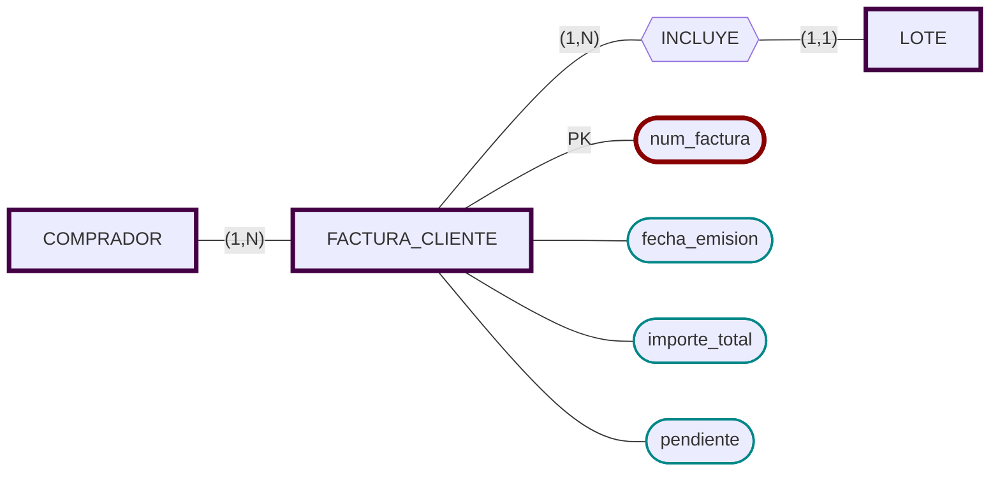

```sql
CREATE TABLE FACTURA_CLIENTE (
    num_factura      	CHAR(10) PRIMARY KEY,
    cod_comprador    	CHAR(5) NOT NULL REFERENCES COMPRADOR,
    fecha_emision    	DATE NOT NULL,
    importe_total    	NUMBER(10,2),
    pendiente           NUMBER(1,0) DEFAULT 0
			-- 1 = pendiente, 0 = pagada
);

CREATE TABLE INCLUYE (
    num_factura   CHAR(10) REFERENCES FACTURA_CLIENTE,
    cod_lote      CHAR(5)  REFERENCES LOTE UNIQUE,
    PRIMARY KEY (num_factura, cod_lote)
);

```
- INCLUYE es la relación N:M.
- PRIMARY KEY (num_factura, cod_lote) impide repetir un lote en la misma factura.

Estado Pagada: 
- 0 = pendiente
- 1 = pagada
- `DEFAULT 0` asegura que todas las facturas nuevas comiencen como pendientes.
- Este campo actúa como booleano (0 = pendiente, 1 = pagada).
- Guardamos el estado para todas las facturas, aunque solo sea relevante para compradores al contado. Para el grupo que no es de interés se pueden poner como pagadas automaticamente.
  
Cada comprador puede emitir varias facturas; cada factura agrupa varios lotes.

Cada lote pertenece a una única factura (por post-adjudicación).


### Venta
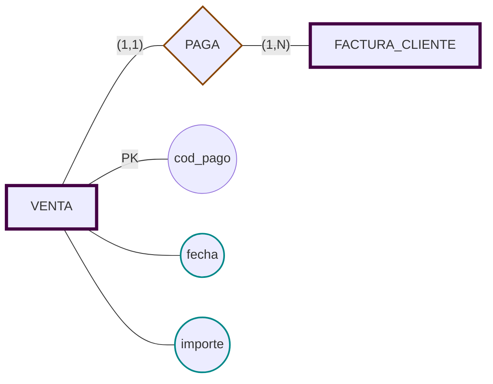

```sql
CREATE TABLE VENTA (
    cod_pago      CHAR(5) PRIMARY KEY,
    num_factura   CHAR(10) REFERENCES FACTURA_CLIENTE,
    fecha         DATE,
    importe       NUMBER(10,2)
	);
```

Una factura pertenece a un único comprador, pero puede incluir varios lotes adquiridos.

Cada lote adjudicado debe aparecer en exactamente una factura.


---

# Factura Proveedor
Las facturas emitidas por los barcos,
- [x] Datos básicos
	- [x] Número de factura
	- [x] Fecha de emisión
	- [x] Importe total.
- [x] el CIF del barco (desde matricula)
- [x] Los códigos de lote facturados


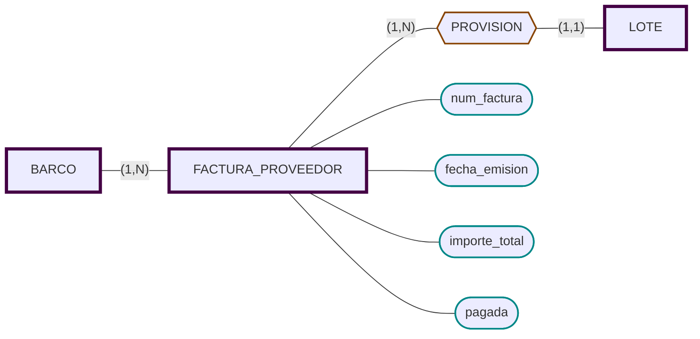
```sql
CREATE TABLE FACTURA_PROVEEDOR (
    num_factura  		CHAR(10) PRIMARY KEY,
    matricula          	CHAR(10) NOT NULL REFERENCES BARCO,
    fecha_emision      	DATE NOT NULL,
    importe_total      	NUMBER(10,2),
    pagada             	NUMBER(1,0) DEFAULT 0
    -- 0 = pendiente, 1 = pagada
	);

CREATE TABLE PROVISION (
    num_factura  			CHAR(10) REFERENCES FACTURA_PROVEEDOR,
    cod_lote           		CHAR(5)  REFERENCES LOTE UNIQUE,
    PRIMARY KEY (num_factura, cod_lote)
	);

CREATE TABLE PAGO_BARCO (
    cod_pago      CHAR(5) PRIMARY KEY,
    num_factura   CHAR(10) REFERENCES FACTURA_PROVEEDOR,
    fecha         DATE,
    importe       NUMBER(10,2)
);
```
Aunque el enunciado dice que en la factura se almacena el CIF del barco, optamos por guardar el CIF como atributo del BARCO y referenciar el barco desde FACTURA_PROVEEDOR usando su clave actual. 

Así evitamos redundancia; el CIF es accesible mediante una consulta.
Otra alternativa sería cambiar la clave principal o hacer una compuesta. Al ser requisitos bastante separados, es posible que sea una confusión del cliente, ya que el campo cif no estaba requerido en la información del barco. Por tanto, técnicamente no está relacionando una entidad con otra añadir el cif a la factura. 

Considero que esta opción es la más sencilla, y que la interfaz puede presentar está información como el cliente prefiera. Antes de implementar esta decisión de diseño consultaría con el cliente.


      


### 3.1. Modelo ERE.
A partir de la información descrita en al anterior apartado realizar el diseño del esquema conceptual (ERE).

Dicho documento, además de contar con el grafo ERE ajustado a los elementos impartidos en clase, ha de contar con un apartado que indique, razonadamente, todos los supuestos semánticos que se han realizado, y que surgen de la ausencia de información relativa en ellos en el propio enunciado.
En definitiva, se trata de incluir, además de los supuestos semánticos que se consideren oportunos para justificar todas las decisiones de diseño y la semántica perdida si la hubiese, los siguientes elementos:
- Entidades.
- Interrelaciones (Relaciones).
- Tipo de Interrelaciones (Tipo de Relación).
- Participación de las entidades en las Interrelaciones.
- Participaciones máximas y mínimas de las entidades en las Interrelaciones.
- Respecto a las relaciones, existe una relación ternaria que el alumno debe identificar.
De igual manera se debe identificar la cardinalidad de cada rama, así como las
participaciones máximas y mínimas.
- Atributos según tipología.
- Generalización – Especialización.
- … en definitiva todos los elementos explicados para los esquemas ERE necesarios para
reflejar el enunciado los más fielmente posible.


### 3.2. Modelo Relacional.
Basándose en el esquema conceptual (Modelo ERE) desarrollado en el anterior apartado
se deberá crear el Modelo Relacional, el cual reflejará lo más fielmente posible una solución al
problema que se nos plantea. Éste se ha de documentar utilizando la herramienta Microsoft Visio
usando la plantilla para Bases de Datos relacionales con notaciones IDEF1X haciendo constar,
los siguientes elementos:
- Tablas con sus atributos o campos y sus dominios.
- Claves Primarias y Alternativas.
- Claves Ajenas indicando su dependencia.
- Los posibles o no nulos.
- Valores por defecto.
- Cardinalidades.
- Acción para la preservación de la Integridad Referencial.
- … en definitiva, todos los elementos explicados para los esquemas relacionales que sean necesarios para plasmar el enunciado.
- 
Solo se podrán usar los siguientes tipos de datos:
- VARCHAR,
- CHAR,
- NUMBER
- y DATE.

Recordad que es importante que el tipo de dato, y en general el dominio de cada atributo, esté desarrollado conforme al concepto que representa.

La forma de transformar una relación ternaria del tipo Muchos, Muchos, Muchos (N:N:N) es, una vez creadas las tablas correspondientes a las entidades partícipes, crear una nueva tabla que representará dicha relación ternaria y que debe incluir como claves foráneas las claves principales de cada una de las tres entidades partícipes. El conjunto formado por estas claves foráneas será la clave principal de la nueva tabla. En dicha nueva tabla se debe incluir también los atributos de la relación siguiendo los mismos criterios que se siguen en los atributos de una relación binaria de tipo N:N.

### 3.3. Creación de la base de datos.
En consonancia con lo desarrollado en el anterior apartado, construid el definitivo esquema de base de datos relacional en Access.

### 4. Formato y fecha de entrega

Se entregará un fichero comprimido en formato .zip o .rar cuyo contenido ha de ser:

a) Un documento de Word o pdf con la siguiente información:

1. DNI, Nombre y Apellidos del Alumno.
2. Diseño Conceptual incluyendo los supuestos semánticos y la semántica
perdida.
   1. El fichero Microsoft Visio con el diseño del modelo relacional.
   2. Las base de datos de Access que se construya a partir del modelo relacional.
   
# Diagrama Global


 
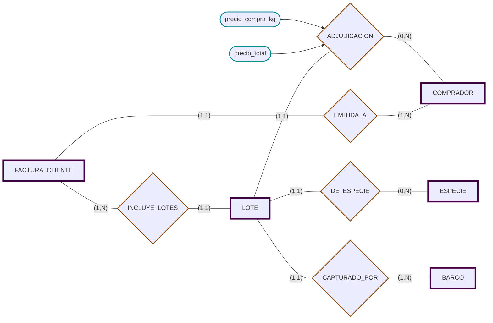
# Relacional
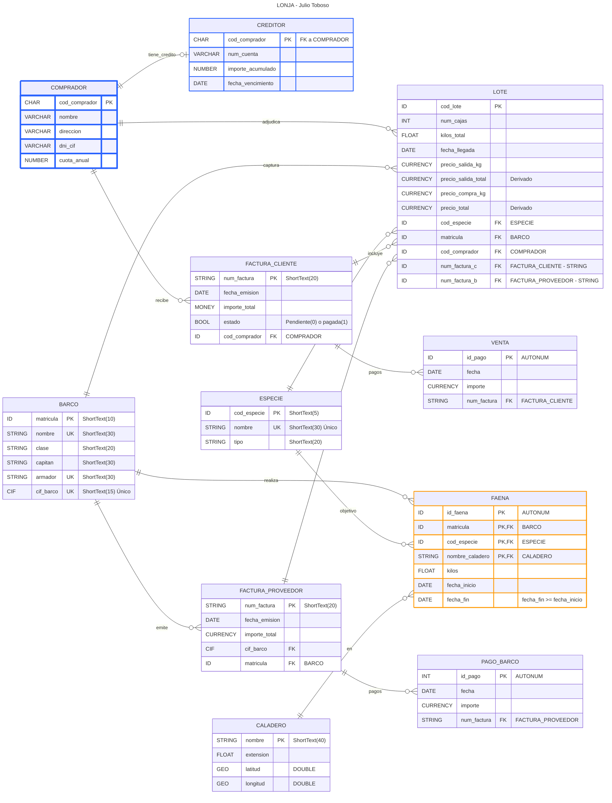

```
 
