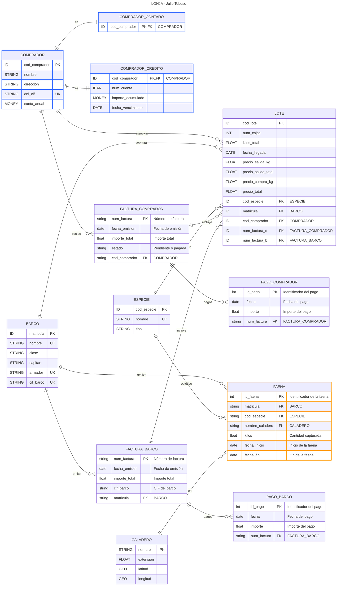

```mermaid
---
title: LONJA - Julio Toboso
---
erDiagram
    direction LR

    %% ======== ENTIDADES PRINCIPALES ======== %%

    COMPRADOR {
        ID     cod_comprador PK ""
        STRING nombre           ""
        STRING direccion        ""
        STRING dni_cif       UK ""
        MONEY  cuota_anual       ""
        }

        %% ======== ESPECIALIZACIÓN DE COMPRADORES ======== %%
        COMPRADOR_CONTADO {
            ID cod_comprador PK, FK "COMPRADOR" 
            }

        COMPRADOR_CREDITO {
            ID     cod_comprador PK, FK "COMPRADOR" 
            IBAN   num_cuenta           ""
            MONEY  importe_acumulado    ""
            DATE   fecha_vencimiento    ""
            }

    ESPECIE {
        ID     cod_especie  PK  
        STRING nombre       UK ""
        STRING tipo            ""
        }

    CALADERO {
        STRING    nombre     PK   ""
        FLOAT     extension       ""
        GEO       latitud         ""
        GEO       longitud        ""
        }

    BARCO {
        ID     matricula PK  ""
        STRING nombre    UK  ""
        STRING clase         ""
        STRING capitan       ""
        STRING armador   UK  ""
        STRING cif_barco UK  ""
        }


    %% ======== LOTES Y SUBASTAS ======== %%
    LOTE {
        ID       cod_lote      PK    ""
        INT      num_cajas           ""
        FLOAT    kilos_total         ""
        DATE     fecha_llegada       ""
        FLOAT    precio_salida_kg    ""
        FLOAT    precio_salida_total ""
        FLOAT    precio_compra_kg    ""
        FLOAT    precio_total        ""
        ID       cod_especie   FK    "ESPECIE"  
        ID       matricula     FK    "BARCO" 
        ID       cod_comprador FK    "COMPRADOR"  
        ID       num_factura_c FK    "FACTURA_COMPRADOR"  
        ID       num_factura_b FK    "FACTURA_BARCO"  
        }

    %% ======== FAENA (RELACIÓN TERNARIA) ======== %%
    FAENA {
        int id_faena PK "Identificador de la faena"
        string matricula FK "BARCO"  
        string cod_especie FK "ESPECIE"  
        string nombre_caladero FK "CALADERO"  
        float kilos "Cantidad capturada"
        date fecha_inicio "Inicio de la faena"
        date fecha_fin "Fin de la faena"
    }

    %% ======== FACTURAS Y PAGOS ======== %%
    FACTURA_COMPRADOR {
        string num_factura PK "Número de factura"
        date fecha_emision "Fecha de emisión"
        float importe_total "Importe total"
        string estado "Pendiente o pagada"
        string cod_comprador FK "COMPRADOR" 
    }

    PAGO_COMPRADOR {
        int id_pago PK "Identificador del pago"
        date fecha "Fecha del pago"
        float importe "Importe del pago"
        string num_factura FK "FACTURA_COMPRADOR" 
    }

    FACTURA_BARCO {
        string num_factura PK "Número de factura"
        date fecha_emision "Fecha de emisión"
        float importe_total "Importe total"
        string cif_barco "CIF del barco"
        string matricula FK "BARCO"  
    }

    PAGO_BARCO {
        int id_pago PK "Identificador del pago"
        date fecha "Fecha del pago"
        float importe "Importe del pago"
        string num_factura FK "FACTURA_BARCO" 
    }

    %% ======== RELACIONES Y CARDINALIDADES ======== %%

    %% --- Compradores --- %%
    COMPRADOR ||--|| COMPRADOR_CONTADO : "es"
    COMPRADOR ||--|| COMPRADOR_CREDITO : "es"
    COMPRADOR ||--o{ LOTE : "adjudica"
    COMPRADOR ||--o{ FACTURA_COMPRADOR : "recibe"
    FACTURA_COMPRADOR ||--o{ PAGO_COMPRADOR : "pagos"

    %% --- Barcos --- %%
    BARCO ||--o{ FAENA : "realiza"
    BARCO ||--o{ LOTE : "captura"
    BARCO ||--o{ FACTURA_BARCO : "emite"
    FACTURA_BARCO ||--o{ PAGO_BARCO : "pagos"

    %% --- Especies y Caladeros --- %%
    ESPECIE ||--o{ LOTE : "clasifica"
    ESPECIE ||--o{ FAENA : "objetivo"
    CALADERO ||--o{ FAENA : "en"

    %% --- Facturas y Lotes --- %%
    FACTURA_COMPRADOR ||--o{ LOTE : "incluye"
    FACTURA_BARCO ||--o{ LOTE : "incluye"

    %% --- Estilo visual --- %%
    style COMPRADOR_CONTADO stroke:#2962FF,stroke-width:2px
    style COMPRADOR_CREDITO stroke:#2962FF,stroke-width:2px
    style COMPRADOR stroke:#2962FF,stroke-width:2px
    style FAENA stroke:#FF9800,stroke-width:2px


```
